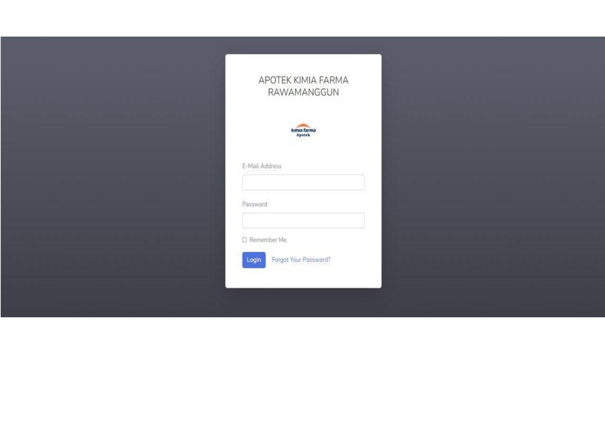
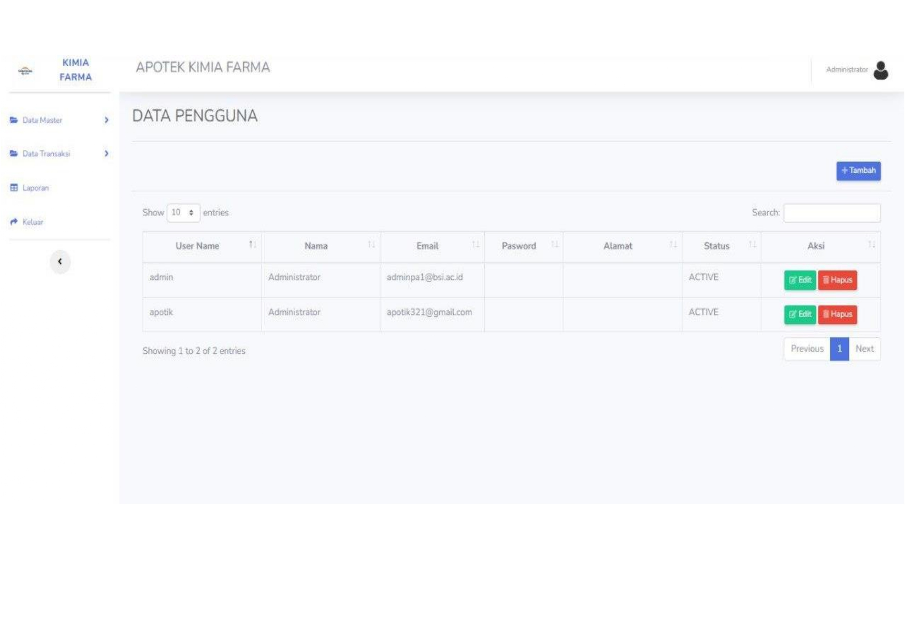
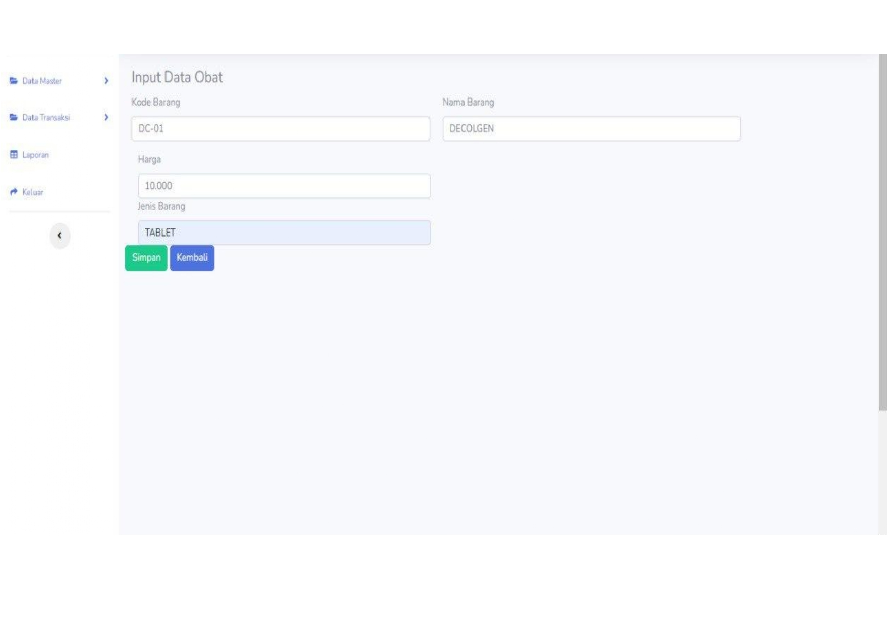
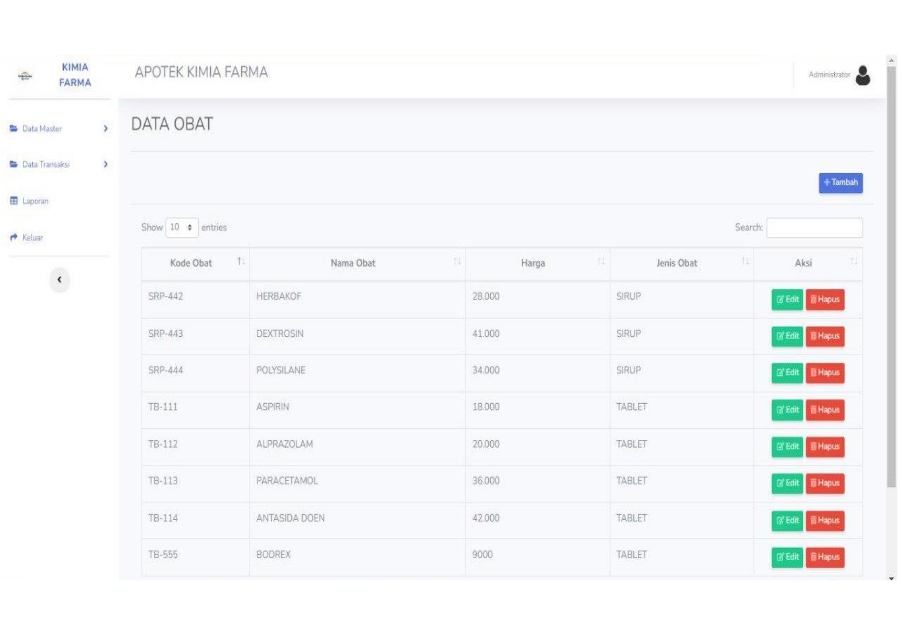
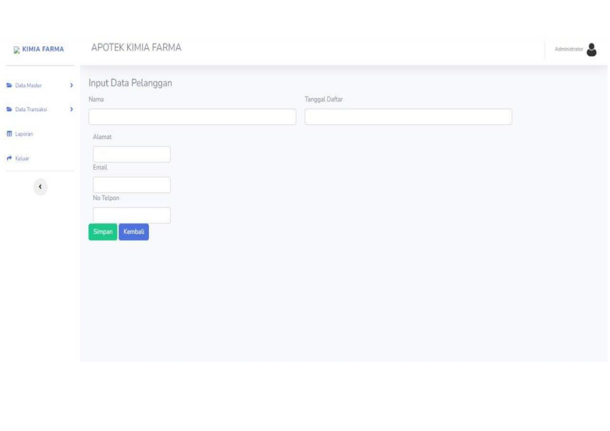
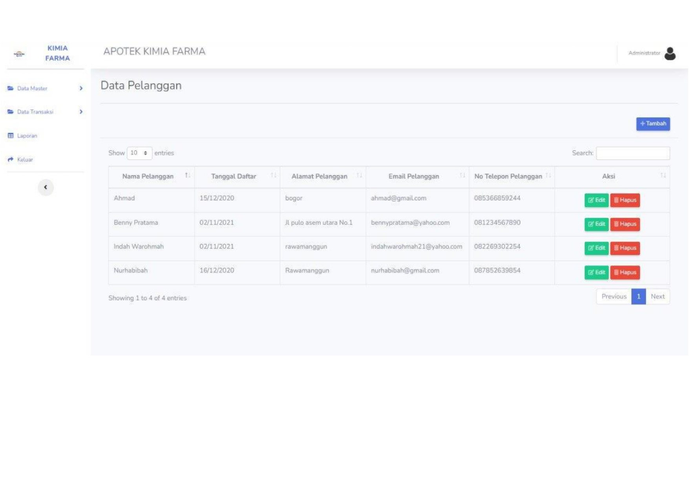
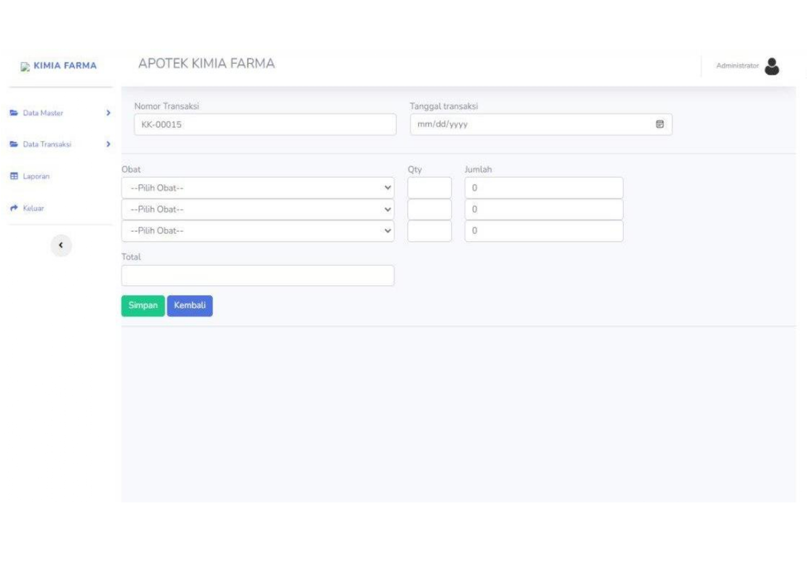
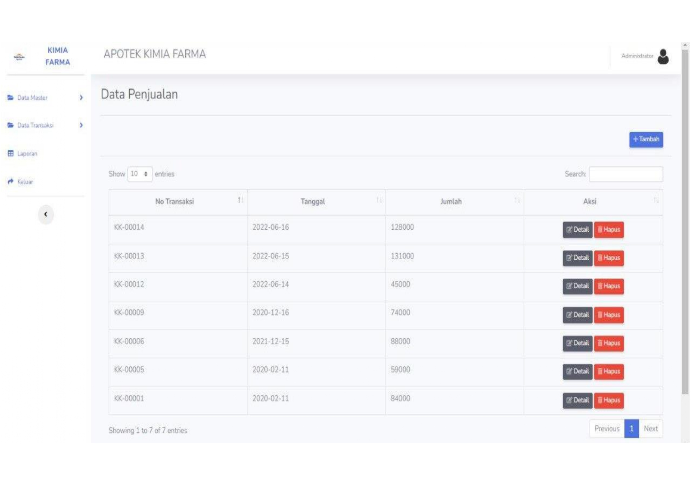
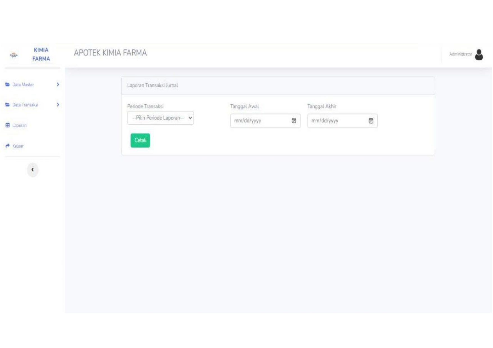

# Project Laravel Akuntansi Penjualan

Sebuah rancangan sistem akuntansi penjualan yang dapat memberikan informasi yang cepat dan tepat. Sistem akuntansi penjualan ini dapat memproses data secara akurat agar laporan pengelolahan data menjadi lebih efektif dan efesien sehingga meningkatkan kinerja.

## Instalasi

* Git clone :
https://github.com/habibahnrh/ProjectPortofolio

## Setup

* Buka direktori project di terminal
* Ketikan command : cp.env.example.env (copy paste file .env.example)
* Buat database

Lalu ketik command dibawah ini :
* composer install
* Php artisan optimize:clear
* Php artisan key:generate (generate app key)
* Php artisan migrate (migrasi database)
* Php artisan db:seed --class=UserClass (mengisi data table users)

## Login

- Email : adminpa1@bsi.ac.id
- Password : adminpa1

## Fitur

- Form login
- Input dan tampilan data user
- Input dan tampilan data barang
- Input dan tampilan data pelanggan
- Transaksi dan data penjualan
- Laporan penjualan 

## Preview

- Form login

- Input dan tampilan data user

- Input dan tampilan data barang

- Input dan tampilan data pelanggan

- Transaksi dan data penjualan

- Laporan penjualan

## Author

Nurhabibah

